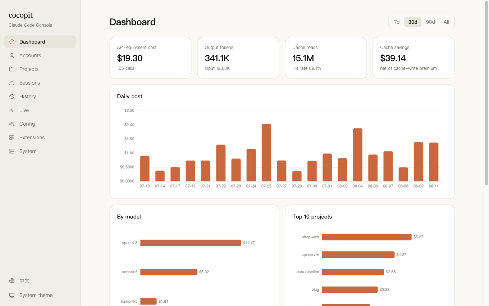
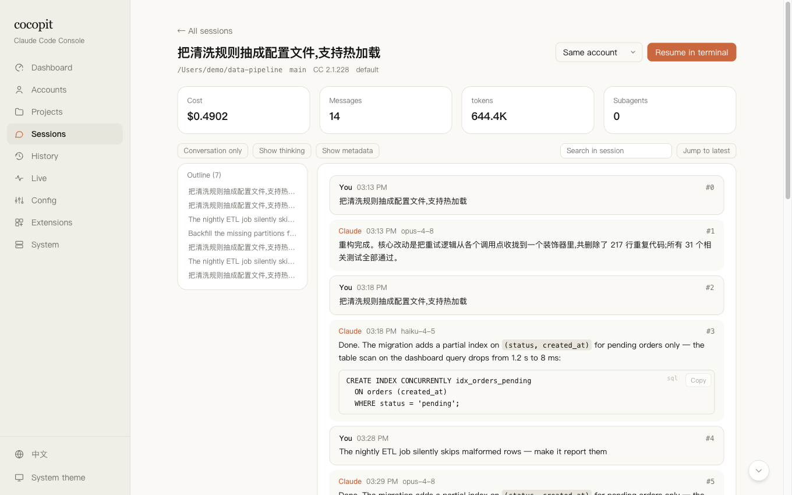
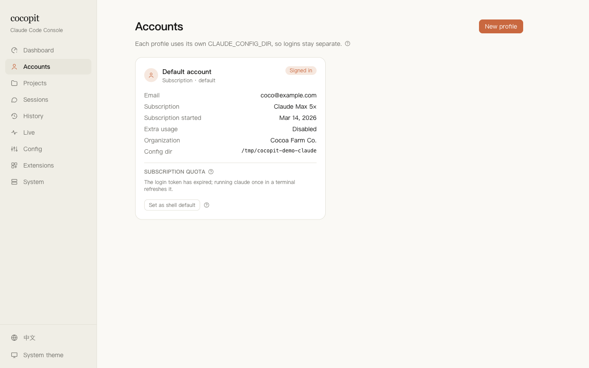
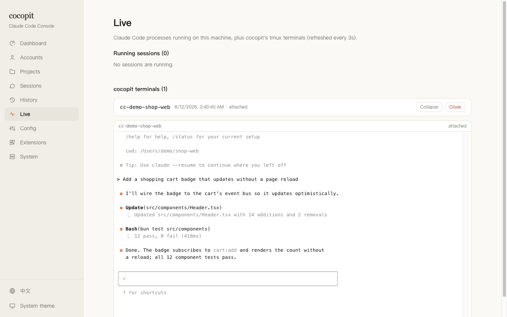
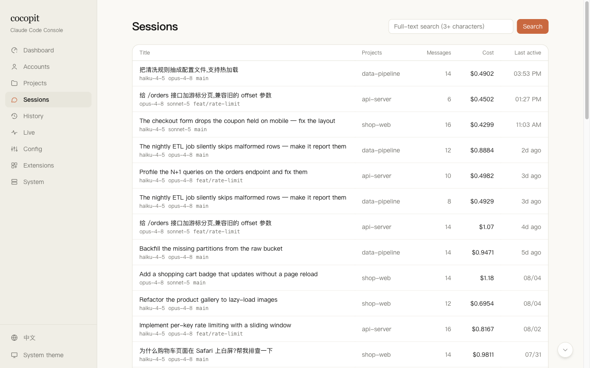

<p align="center">
  
</p>

<h1 align="center">cocopit</h1>

<p align="center">
  A local-first web console for <a href="https://www.anthropic.com/claude-code">Claude Code</a> — usage & cost analytics, session browsing, multi-account management, config & permission editing, and a built-in web terminal.
</p>

<p align="center">
  <a href="README.zh-CN.md">中文(可可坑)</a> ·
  <a href="docs/manual.md">User manual</a> ·
  <a href="docs/manual.zh-CN.md">用户手册</a>
</p>

<p align="center">
  
  
  
</p>

---

<p align="center">
  
</p>

<table>
  <tr>
    <td></td>
    <td></td>
  </tr>
  <tr>
    <td></td>
    <td></td>
  </tr>
</table>
## What it does

- **Dashboard** — API-equivalent cost, tokens, cache efficiency (with an honest hit-rate definition), daily cost chart, weekday×hour heatmap, per-model / per-project / per-account breakdowns. Day and hour buckets follow *your* browser's timezone, not the server's.
- **Subscription quota** — the same 5-hour / weekly window numbers `/usage` shows inside Claude Code, on the dashboard and per account. Credentials never leave the server process and are never sent to the browser.
- **Sessions** — full-text search (CJK included) across every transcript, filters by project / account / time, windowed reading of arbitrarily large transcripts, conversation outline, in-session search, subagent transcripts, rewound-branch visibility, and cross-file fork/continuation links.
- **Prompt history** — every prompt you ever typed, searchable, linked back to its session.
- **Accounts** — multiple subscription logins (isolated `CLAUDE_CONFIG_DIR`s) and API-key profiles side by side; per-account cost attribution; resume any session under any account.
- **Web terminal** — resume sessions or start new ones in the browser. Sessions run inside tmux on the server: closing the tab doesn't kill them, reconnecting reattaches. Touch devices get an Esc / Tab / ^C / arrows key bar and clipboard paste.
- **Config** — edit `settings.json` (user & project scope) with validation, diff preview, automatic pre-write backups and conflict detection; named settings presets; a pricing table editor with LiteLLM comparison.
- **System** — index status, disk usage triage & safe cleanup (dry-run first, active sessions always excluded), config backup browser with diff & restore, remote-access settings.

Everything is derived from Claude Code's own files (`~/.claude/`). cocopit never writes to them except the settings files you explicitly save from the Config page — and every such write is preceded by a backup.

## Quick start

Requires [Bun](https://bun.sh) (and `tmux` for the web terminal). No other runtime dependencies — the server uses Bun built-ins only.

```bash
# no install — run straight from the registry
bunx cocopit

# or install globally
bun install -g cocopit
cocopit
```

Then open http://127.0.0.1:7433.

```bash
cocopit --port 8080            # pick a port (also: COCOPIT_PORT, or config.json)
cocopit --host 0.0.0.0         # bind beyond loopback (requires an access token — see below)
cocopit --help
```

cocopit runs in the foreground, like any server. To keep it running in the background:

```bash
nohup cocopit > ~/.cocopit/cocopit.log 2>&1 &     # plain background job
tmux new -d -s cocopit cocopit                     # or under tmux
```

### From source

```bash
git clone https://github.com/gps949/cocopit.git && cd cocopit
bun install && bun run build
bun run start                  # or: bun bin/cocopit.ts --port 8080
```

The first launch scans `~/.claude/projects` into a local SQLite index (about 40 s for a 5 GB history; progress shows live in the UI and you can start using it immediately). Subsequent launches only scan what changed — typically under a second.

For development: `bun run dev` runs the backend in watch mode plus Vite HMR at http://127.0.0.1:5173.

```bash
bun test             # run the test suite
```

## Where your data lives

| Path | What | Access |
| --- | --- | --- |
| `~/.claude/` | Claude Code's own data: transcripts, config, plugins | **read-only**, except `settings.json` when you explicitly save from the Config page |
| `~/.claude.json` | Claude Code's main config | **never written**, read for display only |
| `~/.cocopit/index.db` | cocopit's SQLite index | derived data — delete it anytime, it rebuilds on restart |
| `~/.cocopit/config.json` | cocopit's own settings (port, listen address, …) | written by the System page |
| `~/.cocopit/auth.json` | sha256 of the access token | written by the System page |
| `~/.cocopit/backups/` | pre-write backups of every config file cocopit ever touched | restore from the System page |

## Remote access

By default cocopit listens on `127.0.0.1` only. To reach it from another machine, **set an access token on the System page first, then change the listen address** — the server refuses to bind a non-loopback address without a token, because the built-in terminal is a shell on the host machine.

- The token is stored as a sha256 hash; after login the browser holds a signed, expiring HttpOnly cookie, never the token itself.
- Lost the token? Delete `~/.cocopit/auth.json` on the server.
- Behind a reverse proxy, add your public origin to `allowedOrigins` on the System page, or cross-origin protection will reject writes. Cookies get `Secure` automatically over HTTPS.

## Security model in one paragraph

The browser never sees credentials: OAuth tokens are read from the macOS Keychain (or `<config-dir>/.credentials.json` on Linux/Windows) inside the server process, used for a single upstream quota query, and never logged, persisted, or returned. Terminal commands are constructed server-side — the browser only ever sends a session or project id, never a command string. All state-changing requests pass an Origin gate; WebSocket upgrades have their own. Config writes go through a whitelist, a pre-write backup, and a compare-and-swap stamp so concurrent edits fail loudly instead of silently overwriting.

## Troubleshooting

- **Port taken** — change `port` in `~/.cocopit/config.json`, or delete the file to restore the default 7433.
- **Numbers look wrong** — delete `~/.cocopit/index.db` and restart; the index is fully derived and rebuilds from your transcripts.
- **Quota shows "token expired"** — run any `claude` command once in a terminal; Claude Code refreshes its own token.

## License

MIT
